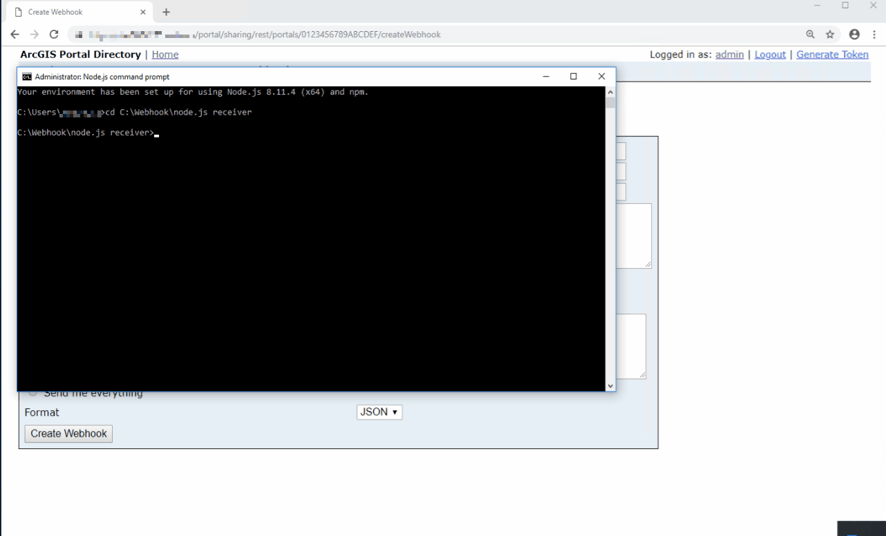

# Creating a webhook receiver with Node.js
[Node.js](https://nodejs.org/en/about/) is a JavaScript runtime that allows you to quickly build and deploy web applications.  We will be using Node.js to deploy a simple application that listens on a local port for POST requests (our webhook payloads), and then writes those payloads to a textfile on disk.  

#### Step One: Install Node.js
Before you begin, ensure you have installed [Node.js](https://nodejs.org/dist/latest-v8.x/) **version 8.x** :point_left:  

Once installed, you can confirm the version by typing `node -v` in your command prompt. 


#### Step Two: Clone or download this repository
Once you have downloaded this repository, you will want to copy the `server.js` into your  **main folder**.  


#### Step Three: Obtain your certificate and update server.js
All communication between Portal and your webhook receiver must be done over HTTPS.  You will need to add a valid certificate to your application's folder. 

Then update the following line in the `server.js` file:
```javascript
const options = {
  pfx: fs.readFileSync('your_certificate.pfx'),
  passphrase: 'certificate password'
};
```


#### Step Four: Launch your receiver
Go to your command prompt and launch the application:
```base
cd <application's path>
node server.js
```
The application will be running on **port 8000**.  You can now use this URL as your payload URL parameter. **Note**: If the server refuses to start with an error `Cannot find module node-fqdn`, from the command window, install the required module and try to start the server again: 
```
npm install node-fqdn
```

 

Any payloads received will be written to the `webhookPayloads.txt` file in `c:\temp` as well as the console running the server. 

