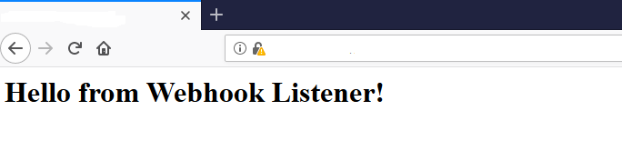

# Creating a webhook receiver with python flask
This is a simple Python Flask web server that can receive incoming Webhook payloads and write to a file on disk. A sample Python Flask receiver which integrates with a simple SMTP email server is available from the [sample-workflows/python](../../../sample-workflows/python-email/) folder.

Note : This guide assumes that Python version 3 on Windows 10. You can follow this web site [Flask Web server](https://projects.raspberrypi.org/en/projects/python-web-server-with-flask/2) for more info.

#### Step One: Install Python and modules
- Install [Python 3](https://www.python.org/downloads) 

- Install the required Python modules with pip

`pip install flask`

`pip install pyOpenSSL`


#### Step Two: Update the code:

- Update the path of `fileName` inside [webhookListener.py](webhookListener.py) for where the `txt` file of payloads will be written too.
```python 
filename = 'C:\\temp\\webhookPayloads.txt' 
```

- Obtain a `.cert` and `.key` file for your machine to run a trusted HTTPS service. Place these files in the same directory as the Python file.

```python
if __name__ == "__main__":
    # Certificate and key file. Cannot be self signed certs 
    context = ('ssl.cert', 'ssl.key')  
    # Listen on port 5000  
    app.run(host='0.0.0.0', port=5000, ssl_context=context, threaded=True, debug=True)     
```

#### Step Three: Run your web server
```bash
$ python webhookListener.py
 * Serving Flask app "webhookListener" (lazy loading)
 * Environment: production
   WARNING: Do not use the development server in a production environment.
   Use a production WSGI server instead.
 * Debug mode: on
 * Restarting with stat
 * Debugger is active!
 * Debugger PIN: 235-907-892
 * Running on https://0.0.0.0:5000/ (Press CTRL+C to quit)
```
- Now you should be able to access the Webhook receiver by visiting `https://<machine.domain.com>:5000` URL
- You should see something similar to the screenshot below in your browser
 

#### Step Four: Configure your Webhook with the Receiver URL
Now you can use `https://<machine.domain.com>:5000` URL as your payload URL when creating your webhook
Any payloads received will be written to the `c:\\temp\\webhookPayloads.txt` file.
