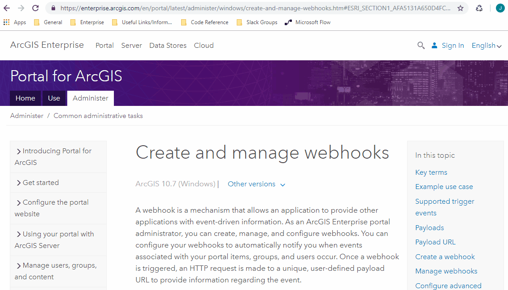
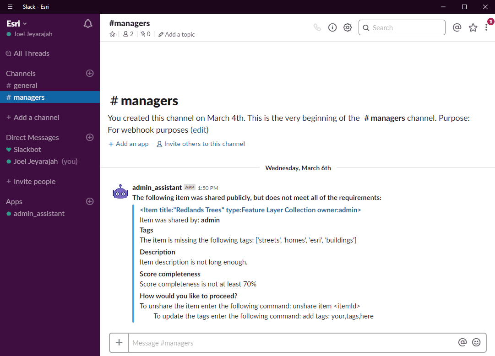

# Getting started with Webhooks in ArcGIS Enterprise.  
One of the new exciting features in ArcGIS Enterprise 10.7 is the ability to create webhooks in your portal :zap::tada:.  Webhooks enable event-driven workflows, allowing you to subscribe to events in your Portal and receive a payload once that event occurs.  Our dev team will be pushing sample applications, and scripts to this repository so you can start implementing webhooks in your organization today! 

Before you begin, you should familiarize yourself with our [help documentation](https://enterprise.arcgis.com/en/portal/latest/administer/windows/create-and-manage-webhooks.htm) and the [ArcGIS REST API](https://developers.arcgis.com/rest/users-groups-and-items/webhooks.htm). You will find a list of event types supported at 10.7, payload properties, sample payload schemas, and so much more!

 

### Webhook Receivers
There are a lot of great services out there like [Zapier](https://zapier.com), [Microsoft Flow](https://us.flow.microsoft.com/en-us/), and [Integromat](https://www.integromat.com) that allow you to build automated workflows with webhooks.  But if you require a more customizable workflow, or need to use webhooks in your disconnected environment then we have some great samples to get you started:
* [Webhook receiver via Java](/java/receiver)
* [Webhook receiver via Python](/python/receiver/flask) 
* [Webhook receiver via Node.js](/javascript/receiver/node.js)

### Workflow samples
Check out this [awesome demo](https://www.esri.com/arcgis-blog/products/arcgis-enterprise/administration/webhooks-dev-summit-2019/) that was given at the 2019 Developer Summit. Learn how the team used webhooks to call an AWS lambda to execute code in a serverless computation engine.  

We also plan to post some sample scripts so you can start incorporating webhooks into your organizations.  For instance, writing up a slack bot to notify you any time an item with incomplete metadata is shared to the public:

 

Or how about using webhooks to help administer the collaborations in your organization.  There is so much you can do with webhooks, and the list of events you can subscribe to is only going to grow from here!  We look forward to seeing what you come up with :smile:

## Resources

* [Portal Admin documentation](https://enterprise.arcgis.com/en/portal/latest/administer/windows/create-and-manage-webhooks.htm)
* [ArcGIS REST API](https://developers.arcgis.com/rest/users-groups-and-items/webhooks.htm)
* [Blog (Coming soon)]()

## Issues

Find a bug or want to request a new feature?  Please let us know by submitting an issue.

## License
Copyright 2019 Esri

Licensed under the Apache License, Version 2.0 (the "License");
you may not use this file except in compliance with the License.
You may obtain a copy of the License at

   http://www.apache.org/licenses/LICENSE-2.0

Unless required by applicable law or agreed to in writing, software
distributed under the License is distributed on an "AS IS" BASIS,
WITHOUT WARRANTIES OR CONDITIONS OF ANY KIND, either express or implied.
See the License for the specific language governing permissions and
limitations under the License.

A copy of the license is available in the repository's [license.txt]( /LICENSE) file.
