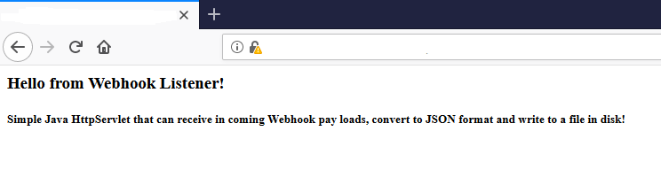

# Creating a webhook receiver using java
This is a simple Java HttpServlet that can receive incoming Webhook payloads, convert it to JSON format and write it to a file on disk.

**Note : This guide assumes that servlet container is Apache Tomcat version 9 and Java SE Development Kit version 8 on Windows 10.**

#### Step One: Install Java SE Development Kit 8 or later and Maven 
- Install Java SE Development Kit 8 or later from [Oracle](https://www.oracle.com/technetwork/java/javase/downloads/jdk8-downloads-2133151.html). 
- Once installed set the JAVA_HOME environment system variable.
- Verify Java installation by running below from a command prompt
```
C:\windows\system32> java -version
java version "1.8.0_144"
Java(TM) SE Runtime Environment (build 1.8.0_144-b01)
Java HotSpot(TM) 64-Bit Server VM (build 25.144-b01, mixed mode)
```
- Install Maven from [Apache](http://maven.apache.org/download.cgi)
- Add a ```MAVEN_HOME``` environment system variables, and point it to the Maven folder
- Add ```%MAVEN_HOME%\bin``` To PATH in system variables
- Check maven version
```
$ mvn -v
Apache Maven 3.6.1 (d66c9c0b3152b2e69ee9bac180bb8fcc8e6af555; 2019-04-04T12:00:29-07:00)
Maven home: C:\apache-maven-3.6.1
```
#### Step Two: Install a Servlet Container like Apache Tomcat and Enable SSL/TLS
- Install the [Tomcat](https://tomcat.apache.org) version 7 or later
- Since we need a Webhook receiver that support https traffic and that can communicate with Portal for ArcGIS you must enable SSL/TLS on your Servlet Container. 
- Please follow steps here: [Enable SSL/TLS](https://tomcat.apache.org/tomcat-8.0-doc/ssl-howto.html). You will need to add a valid certificate to your Tomcat. Let's assume that you enabled port 8443.
- Start your tomcat
```
cd C:\apache-tomcat-9.0.14\bin
$ startup.bat
```

#### Step Three: Clone or download this repository, compile and run
- Clone or downalod this repository. Let's assume that you have cloned to C:\ dir

`git clone git@github.com:Esri/webhooks-samples.git`

- Compile java class :
```
cd C:\webhooks-samples\java\receiver
$ mvn clean install
```
- Once compiled go to `target\classes` folder and copy `WebhookListener.class`

`e.g. C:\webhooks-samples\java\receiver\target\classes\WebhookListener.class`

- Paste your class under your tomcat's `webapps\ROOT\WEB-INF\classes`

`e.g. C:\apache-tomcat-8.5.30\webapps\ROOT\WEB-INF\classes`

- Edit `web.xml` under `webapps\ROOT\WEB-INF` and add below lines
```xml
<web-app>
  <display-name>Webhook Listener Web Application</display-name>
 <servlet>
   <servlet-name>WebhookListener</servlet-name>
   <servlet-class>WebhookListener</servlet-class>
</servlet>

<servlet-mapping>
   <servlet-name>WebhookListener</servlet-name>
   <url-pattern>/WebhookListener</url-pattern>
</servlet-mapping>
 
</web-app>
```
- Restart tomcat
- Now you should be able to access Webhook receiver by visiting `https://<machine.domain.com>:8443/WebhookListener` URL
- You should be able to see something simiar to below on your browser
 

#### Step Four: Configure your Webhook with Receiver URL
Now you can use `https://<machine.domain.com>:8443/WebhookListener` URL as your payload URL when creating your webhook
Any payloads received will be written to the `c:\\temp\\webhookPayloads.txt` file.


