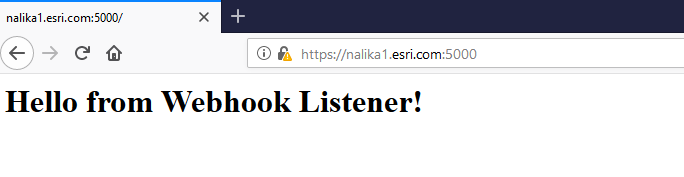

# Creating a webhook receiver with python flask
This is a simple Python Flask web server that can receive incoming Webhook payloads and write to a file on disk.

Note : This guide assumes that Python version 3 on Windows 10. You can follow this web site [Flask Web server](https://projects.raspberrypi.org/en/projects/python-web-server-with-flask/2)  for more info.

#### Step One: Install Python and modules
- Install [Python 3](www.python.org/downloads) 

- Install Python modules with pip

`pip install flask`

Begin by importing libraries:

```python
from flask import Flask, request
from OpenSSL import SSL
import os
import json
```

Set a path to write your received payloads to:
```python 
filename = 'C:\\temp\\webhookPayloads.txt' 
if os.path.exists(filename):
    append_write = 'a' # append if already exists
else:
    append_write = 'w' # make a new file if not
```

#### Step Two: Set parameters for server:

```python
app = Flask(__name__)

@app.route('/', methods=['POST','GET'])
def index():
	if request.method == 'GET':
            return '<h1>Hello from Webhook Listener!</h1>'
	if request.method == 'POST':
            f = open(filename,append_write)
            req_data = request.get_json()
            str_obj = json.dumps(req_data)
            f.write(str_obj+'\n')
            f.close()
            return '{"success":"true"}'

if __name__ == "__main__":   
    context = ('ssl.cert', 'ssl.key') # certificate and key file. Cannot be self signed certs    
    app.run(host='0.0.0.0', port=5000, ssl_context=context, threaded=True, debug=True) # will listen on port 5000
    
    
```
#### Step Three: Run your web server
```bash
$ python webhookListener.py
 * Serving Flask app "webhookListener" (lazy loading)
 * Environment: production
   WARNING: Do not use the development server in a production environment.
   Use a production WSGI server instead.
 * Debug mode: on
 * Restarting with stat
 * Debugger is active!
 * Debugger PIN: 235-907-892
 * Running on https://0.0.0.0:5000/ (Press CTRL+C to quit)
```
- Now you should be able to access the Webhook receiver by visiting `https://<machine.domain.com>:5000` URL
- You should see something similar to the screenshot below in your browser
 

#### Step Four: Configure your Webhook with the Receiver URL
Now you can use `https://<machine.domain.com>:5000` URL as your payload URL when creating your webhook
Any payloads received will be written to the `c:\\temp\\webhookPayloads.txt` file.
