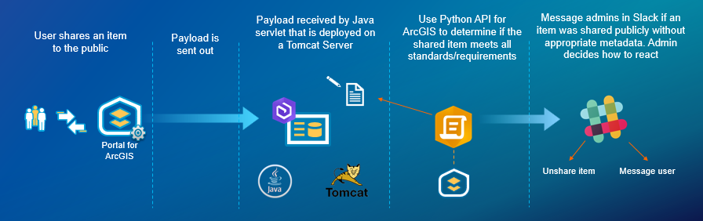

# Webhooks in ArcGIS Enterprise +  the ArcGIS API for python + Slack
The following sample can be used as a guide to create an end to end workflow that integrates ArcGIS Enterprise with Slack.  

### Scenario
As an administrator, I want to be notified any time an item is incorrectly shared publicly.  If an item is shared publicly, I want to examine that item's properties to ensure that it meets our organization standards (complete tags, description, completeness score, thumbnail etc.).  If it does not meet our standards, notify me in slack and allow me to respond and manage that item within slack.  For instance, I should be able to add tags to the item from within slack

 

## How to deploy
View our webinar (link coming soon), to see how we put this all together

### Step One: Install and configure ArcGIS Enterprise
Webhooks were introduced as part of ArcGIS Enterprise 10.7.  You will need to have this installed, and have administrative access in order to continue with this sample. 

### Step Two: Configure webhook receiver
You need to begin by configuring a webhook receiver that will write payloads to a local textfile.  We used our [Java receiver sample](https://github.com/Esri/webhooks-samples/tree/master/java/receiver). 

### Step Three: Python libraries
Python 3 will come installed with your ArcGIS Enterprise deployment.  Use this to install the [arcgis package](https://developers.arcgis.com/python/guide/install-and-set-up/)

There are also a number of packages that need to be installed which can be found in [requirements.txt](/requirements.txt)
You can quickly install these packages using the python package manager pip:
```pip install -r requirements.txt```

### Known limitations
