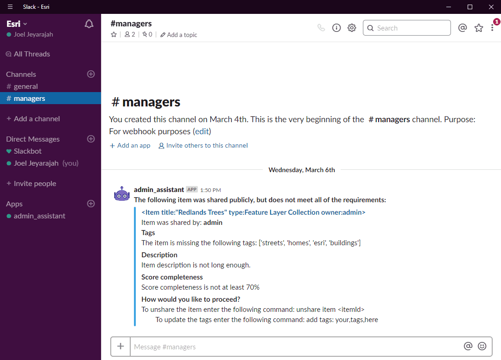

# Webhooks in ArcGIS Enterprise +  the ArcGIS API for python + Slack
The following sample can be used as a guide to create an end to end workflow that integrates ArcGIS Enterprise with Slack.  The scripts and applications were written for the purpose of prototyping. 

### Scenario
As an administrator, I want to be notified any time an item is incorrectly shared to the public.  If an item is shared publicly, I want to examine that item's properties to ensure that it meets our organization standards (complete tags, description, completeness score, thumbnail etc.).  If it does not meet our standards, notify me in slack and allow me to respond and manage that item within slack. 

**Demo components:**
 

**Slack bot:**

 

## How to deploy
View our webinar (link coming soon), to see how we put this all together.

### Step One: Install and configure ArcGIS Enterprise
Webhooks were introduced as part of ArcGIS Enterprise 10.7.  You will need to have this installed, and have administrative access in order to continue with these steps. 

### Step Two: Clone this repository 
All of the samples you will need are included in this repository.  Make a local copy of this repository in your environment. 

### Step Three: Configure webhook receiver
You need to begin by configuring a webhook receiver that will write payloads to a local textfile.  We used our [Java receiver sample](https://github.com/Esri/webhooks-samples/tree/master/java/receiver). 

### Step Four: Python Scripts
Python 3 will come installed with your ArcGIS Enterprise deployment.  
1. Use this to install the [arcgis package](https://developers.arcgis.com/python/guide/install-and-set-up/)
2. There are also a number of packages that need to be installed which can be found in [requirements.txt](requirements.txt)
You can quickly install these packages using the python package manager pip:
```pip install -r requirements.txt```
3. **file_listener.py**
Using the python library [watchdog](https://pythonhosted.org/watchdog/), we monitor the directory where the payloads are being written to. Any time this file is written to/updated, this script will call our main function.  You can copy this script to your workspace. 
4. **admin_assistant.py**
This is our main script, and it contains two functions:
```python 
slackBot()
``` 
The script will parse through the textfile containing the payloads, extract the events and relevant information, and determine what operation was performed. 
If an item was shared to everyone, the script will then call into portal to examine the item's properties. 
If the item's properties do not meet the requirements you have defined in the script, the slack API is used to send a message to the administrator.  You can alter this script to automatically update the missing properties, and bypass this slack component. 

```python 
responseHandler()
``` 
The second function handles the response received in Slack (see the slack bot .gif above).  Using the tags given in the response, the item is updated accordingly. This component requires creating a node.js application that is listening to the slack channel (see below). 
5. **config.py**
The parameters needed to run this script have been externalized in the config file.  After you have cloned this repository, and moved these files into your workspace, you will need to update these variables with the apporpriate values. 

### Step Five: Slack bot with node.js
You will need to have node installed in order to open a web socket that can listen to responses in Slack.  Follow the steps 
